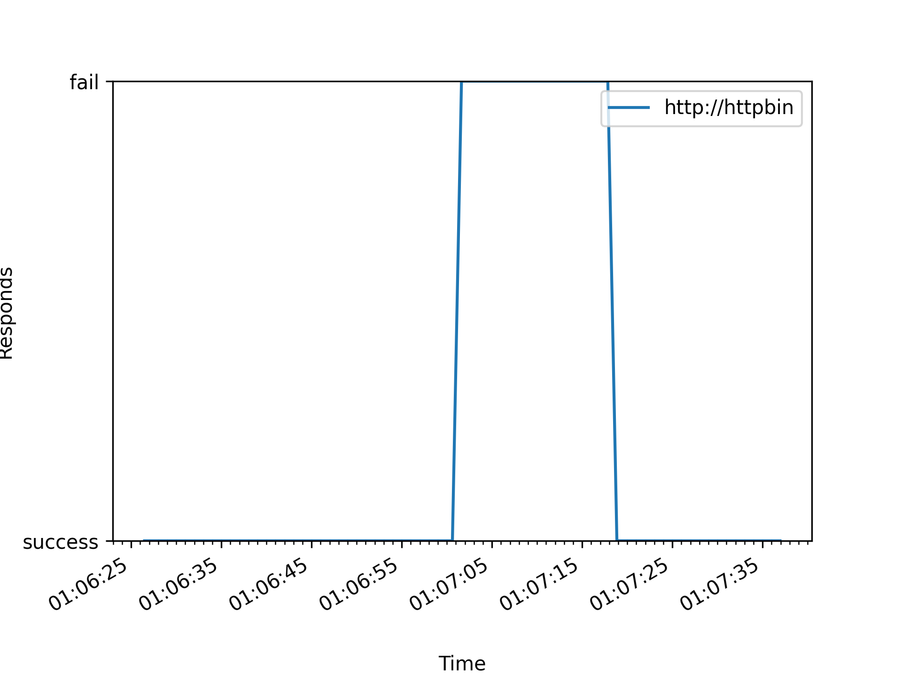

# stats-mam
Generate chart by http response.

#### Usage
```
$ docker run --rm -it \
            -e WATCH_URLS="" \
            -e WATCH_INTERVAL=1 \
            -e OUT_DIR="/app/out" \
            stats-man

$ docker stop stats-man

# stop stats-man will generate chart
$ ls out/
stats-man_20230509-011011.png
```



#### Devel

```
docker rm -f stats-man
docker run -it -p 3003:3000 \
            -v /opt/work/stats-man:/app \
            -v /opt:/opt \
            --name stats-man \
            python:3.10-bullseye bash


docker kill stats-man && docker start stats-man

docker attach stats-man


export WATCH_URLS="http://some-endpoint:8080/,http://some-endpoint2"
export WATCH_INTERVAL=1
export OUT_DIR="/app/out"
python /app/app/main.py
```